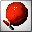
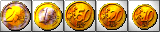
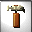
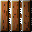
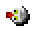
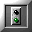
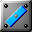
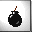
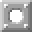

**S-v-N** Software vom Niederrhein presents

- - -

# BALLOONS - prick 'n' puzzle

alpha version 0.1.8-3 - Aug 6, 2007  
©1993-2007 by M. und R. Lagarden  
published under the GPL

- - -

## Content

[TOC]

- - -

## I. The game

### 1. BALLOONS introduces itself

BALLOONS has got 99 level which can consist of one or up to eighteen screens.
BALLOONS has a little bit of _SOKOBAN_, a nice portion **OXYD™** und a lot of
BALLOONS! There will be mazes, tricky stuff, time based level, and you can be
taken for a ride either! BALLOONS intends to make you laugh, to stress you,
and to make you pore.
The landscapes of BALLOONS come with miscellaneous elements. Some walls that
might look inconspicuous, may offer unimagined features: they might be moveable,
destroyable (listen to the sound...), or you can walk right through them.
The aim of the game is to collect a certain number of coins and to go searching
the exit to the next landscape.
These landscape don't just contain the usual obstacles like walls, abysses and
various enemies, but there is also a bunch of balloons containing most of the
coins to be found.

### 2. Getting started

BALLOONS is available as binaries and source distribution for Windows or
linux-like operation systems:
After unpacking the sources, you will have to compile it on a shell.
The binary will be started by executing `./balloons` (POSIX) or
`balloons.exe` (Windows).
This will start BALLOONS in windowed mode. When the Intro finishes, you'll find
yourself in the main menu.

### 3. The main menu

These keys lead to the following actions:

* ++f2++: starts a new game beginning from level one with three lives.
* ++f3++: swaps between one or two player mode. In two player mode, each
  player acts until he has solved his current level.
* ++f4++: lets you enter a level code, so you can (re)start from the
  level you finished the last time.
* ++f6++: _lets you choose between the english, german french or dutch
  language (will be released in a later version...)._
* ++f7++: a short version of this instruction will then be displayed.
  Any key swaps to the next page, ++esc++ brings you back to the main menu.
* ++f8++: the top ten high score list will be displayed.
* ++f9++: a selection of level is shown. ++esc++ brings you back
  to the main menu.
* ++f10++: quits BALLOONS.

When typing in level codes or high score entries, the following keys are useful:

* ++enter++ to finish the input.
* ++esc++ to cancel.
* ++backspace++ to delete the last character.

### 4. Starting to play

The game menu will be shown after the level number has been displayed.
The content of the game menu (as shown from left to right):

* the inventory contains everything you carry with you: your remaining number
of lives and collected items like hammers, tiles, keys. Up to eight are visible.
The item between the two marks on the left lies in your hand. You can act with
it as desribed in the [items and elements](#II) section. Using the
++ctrl++ key lets you swap its position.
* Euros: every pricked balloon and of course the coins make you earn money on
the score. So maybe at the end of the game, you'll join the high score table.
But when playing in two player mode, only the better one wins and will be asked
to sign in!
* Items: The number of coins left to be collected ist shown right here. If it
reaches zero, the exit to the next level will appear.
* Time: this clock counts down in time limited level. When the time passes
before the exit is reached, one life will be lost and the level restarts.

### 5. Main keys when playing

The actor can be moved in any direction using the cursor keys. Actions like
pricking balloons, hammering or placing tiles require the assistance of the
++space++ bar (Support for joysticks is planned...).

* ++esc++: cancel the actual game. Brings you back to the main menu.
* ++f2++: restart the actual level at the loss of one live. When getting
  stuck, this may be the right key to be pressed...
* ++pause++: the game will be paused and the screen will be hidden.
  Pressing any key will continue the game.
* ++ctrl++: swaps items in the inventory.

- - -

## II. Items and elements

### 1. this may be useful for you ...

 balloons have to be pricked, then they will show coins or
items hidden in them.

 these euro coins have to be collected. When the item counter
in the game menu comes to zero, the exit will appear on his position.
Go and reach out for it!

 the hammer lets you destroy certain walls.

 keys can open stones with key holes. Each key can be used for
one door only (f.e. the first that comes along).

 tiles can be placed over abysses. They will grow to a
stable ground plate so you can walk over it.

 the stillage is not only movable, it can close abysses
just like the tiles.

 in time limited level you'll get 15 seconds in reserve,
otherwise 15 cents.

 A new live extends the fun to play!

 this will show the code to the currently played level.
Write it down, so you can restart this level when rejoining the game.

 this looks like a bus stop?!?! Once you've reached this point
and you loose a life (f.e. bij a lightning), this will be your new starting
point.

 this beamer transports you to another place.

 switches may have different functions: some make stones
vanish, some just swap stones. They even can run a

 thrower. His balls can even destroy walls. To make them
reach their goal, there are

 shields. They can be turned to all directions and
they can be movable, too!

 The bomb: fire it and watch out! The floor might get fired
and turn into an abyss and surrounding destroyable walls will eventually open
new ways.

 the snowflake uses magic: It make money out of enemies!

 If you move this open stone on a blinking place, ways can
be opened (or closed).

### 2. This might be bad for you ...

 lightnings and their correspionding stone cost you a life
when touching them.

X X X Aliens are almost there where your way leads you to. Both of you will die
when colliding.

 cracks in the floor can grow worse when remaining too long on
them. At least they end up in an abyss!

### 3. This could be nasty ...

 Arrows only allow movement in one direction.

 Here, you are not allowed to walk through. But be
careful, your enemies are!

sliding doors are almost nasty. They can squeeze you, when you miss the right
moment to pass them!

- - -

## III. System requirements

* Windows or POSIX based operation system, with sound card and graphics with
  640x480 pixels in true color.
* `SDL2`, `SDL2_image`, `SDL2_ttf` and `SDL2_mixer` in a not ancient version.

- - -

© 2007 by Michael and Roland Lagarden  
Version 0.1.8-3 - Aug 6, 2007
